# <第4回課題>

## VPC (Virtual Private Cloud)
- AWS 内で作成する仮想ネットワークのこと

## 1.VPC 構築
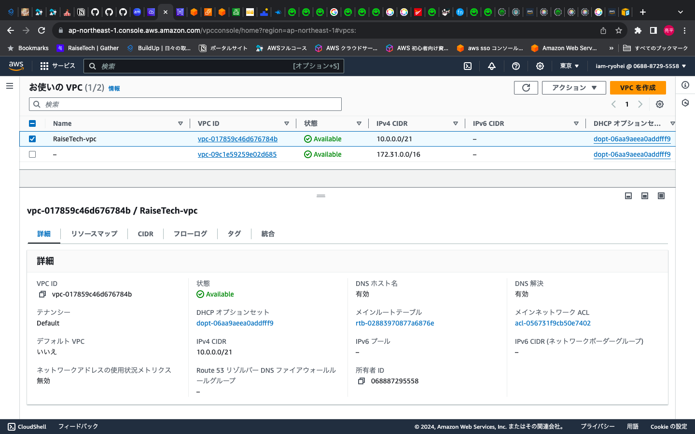

- ### 1-2.VPC リソースマップ
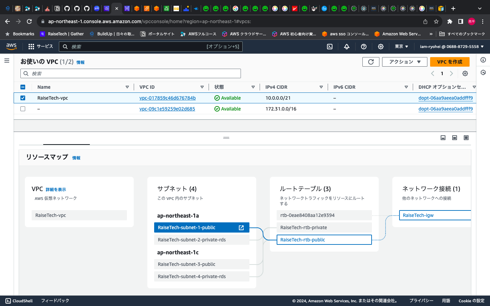

- ### 1-3.VPC サブネット
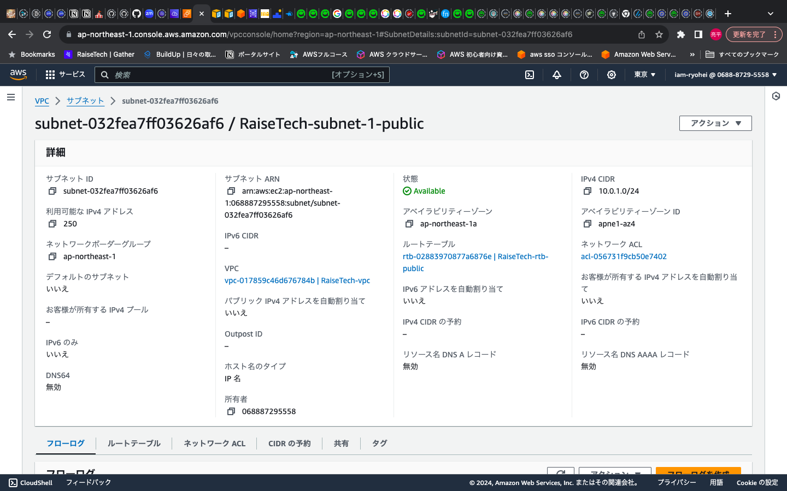
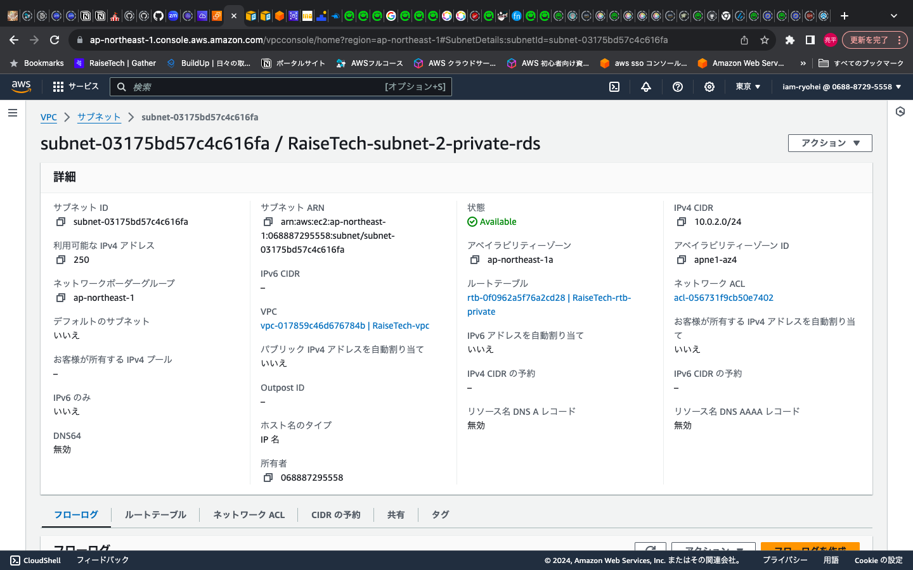

  

## 2.EC2 構築
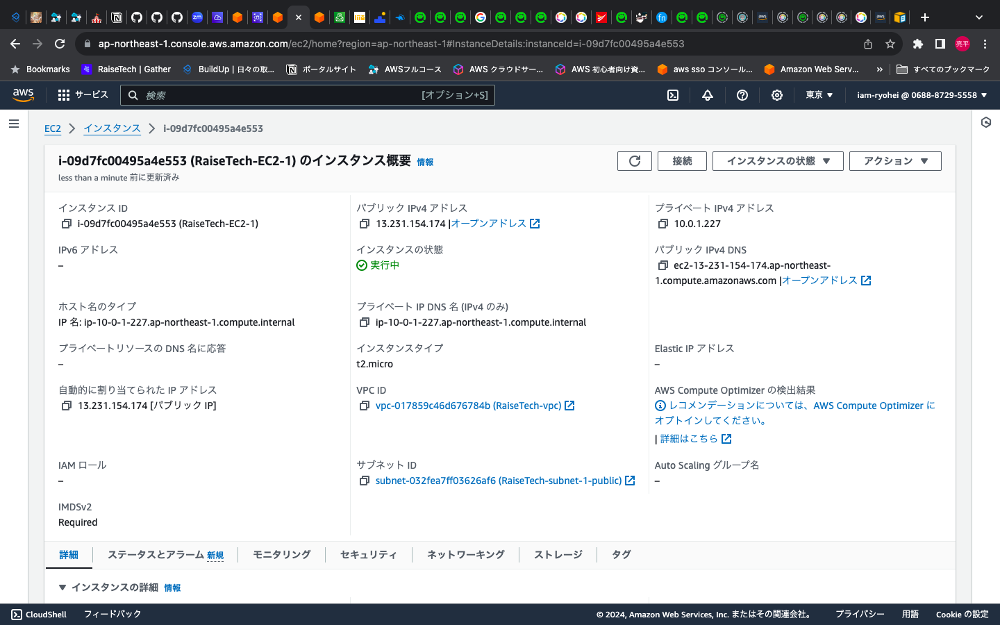
  

## 3.RDS 構築
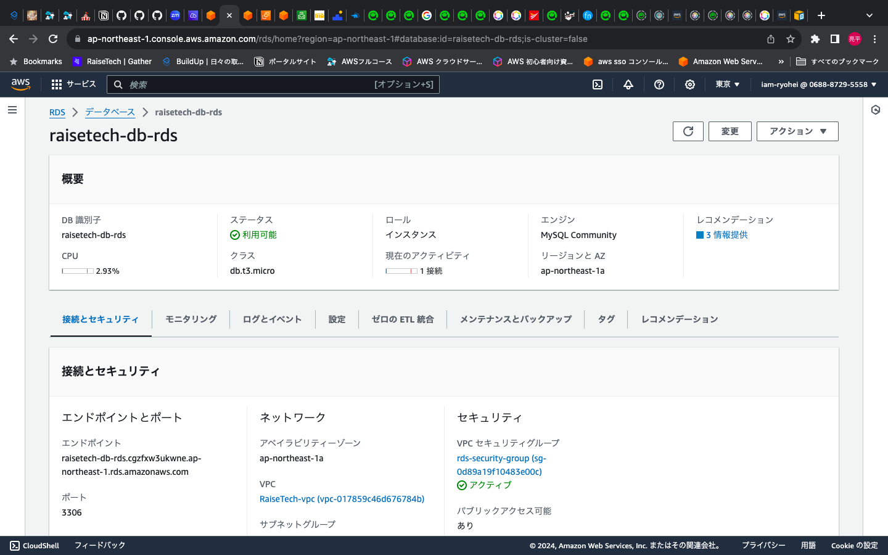
  

## 4.セキュリティグループ
- ### 4-1. EC2
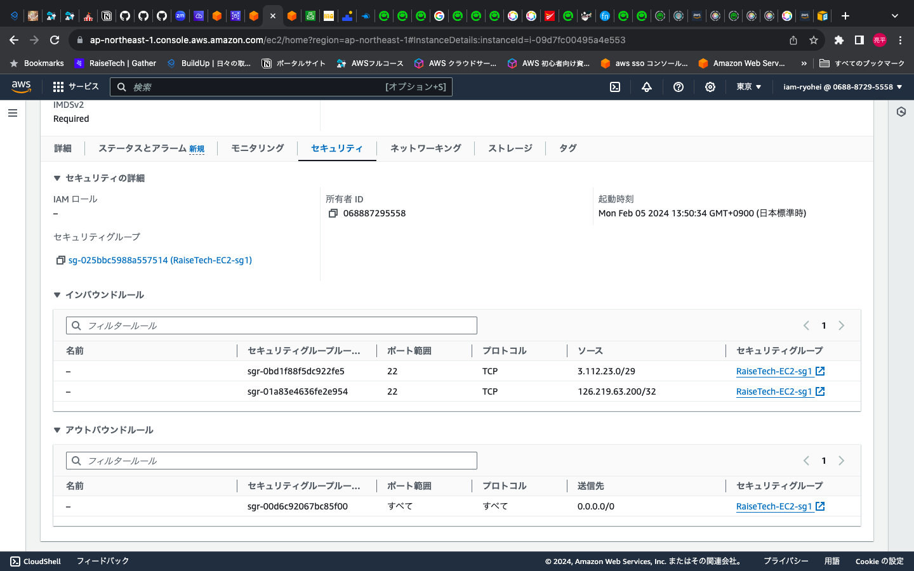
- ### 4-2. RDS-sgインバウンド
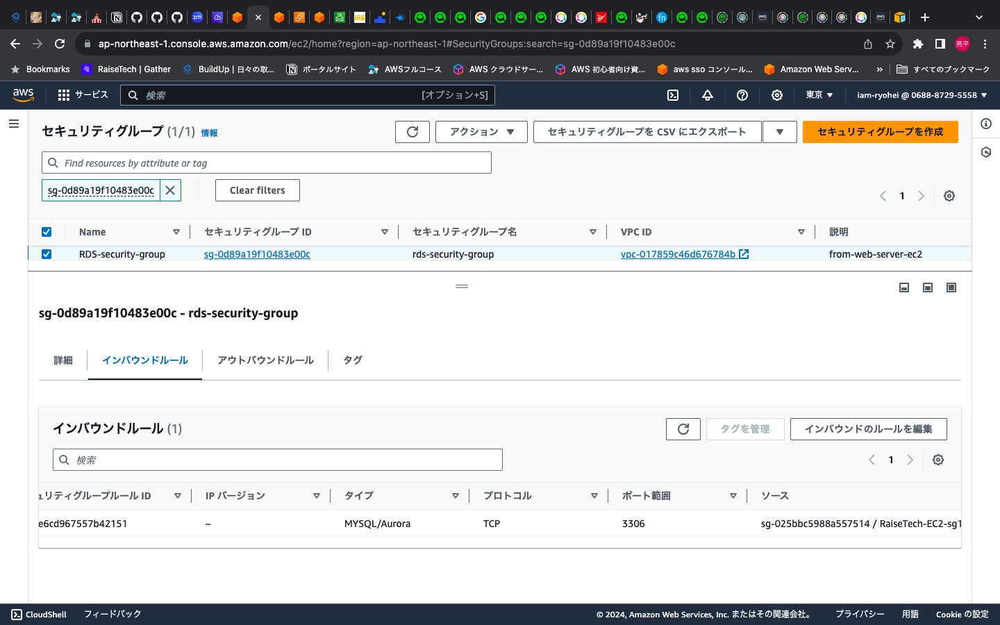

- ### 4-3. RDS-sgアウトバウンド

  

## 5. EC2からRDSへ接続
- ### 5-1. EC2にSSH接続してから、EC2にMySQLをインストール
 - $ sudo yum install mysql  
 
- 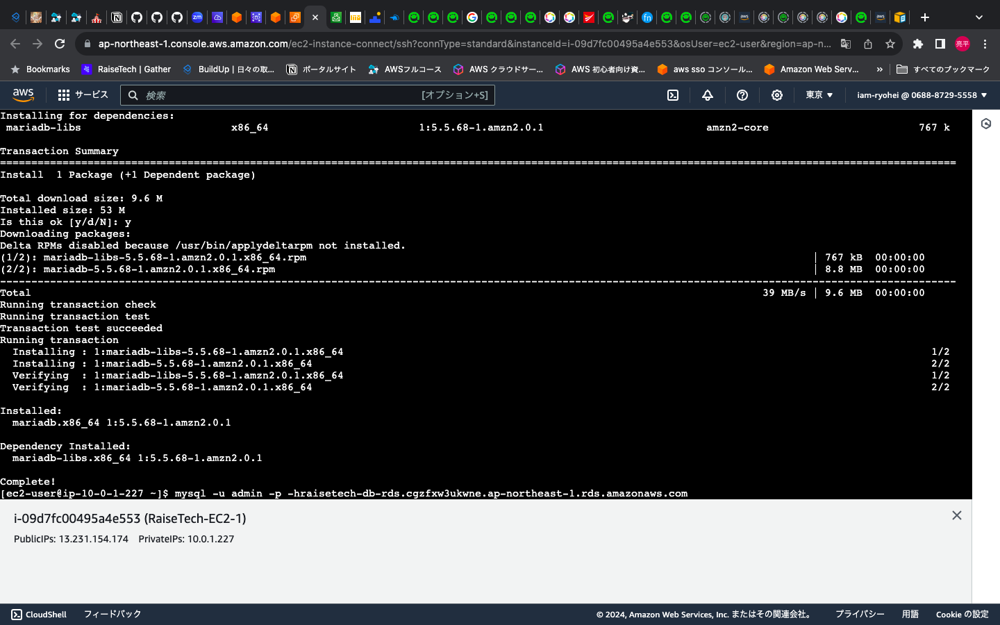
 
　
- #### 最初、MySQLのインストールが出来ないエラーが発生
　- このエラーについて色々と原因を追及し試した上で、最終的にネットワークACLが原因だと理解し、確認して変更したことで解決する
　
   
 
　- ネットワークACL修正前 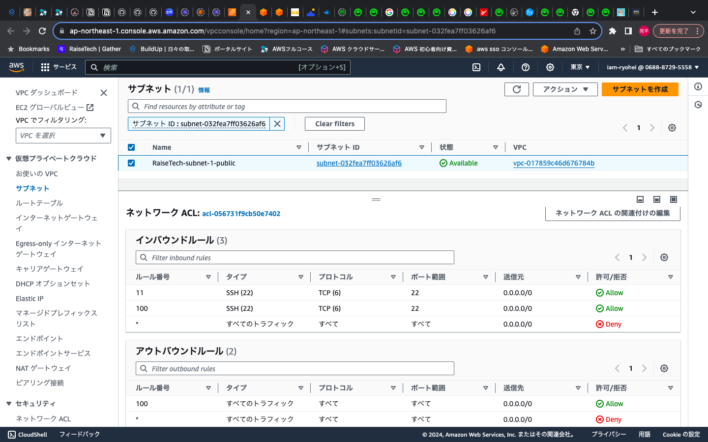
　
   
 - ネットワークACL修正後 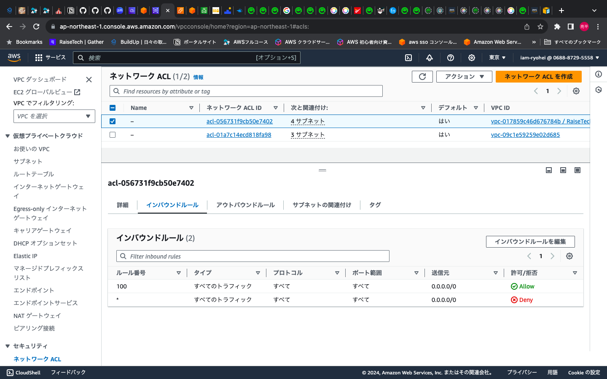
　
- ### 5-2. RDSへの接続
 - $ mysql -u admin -p -h データベースのエンドポイント
 - パスワード入力が求められるので、設定したパスワードを入力する
 
 - 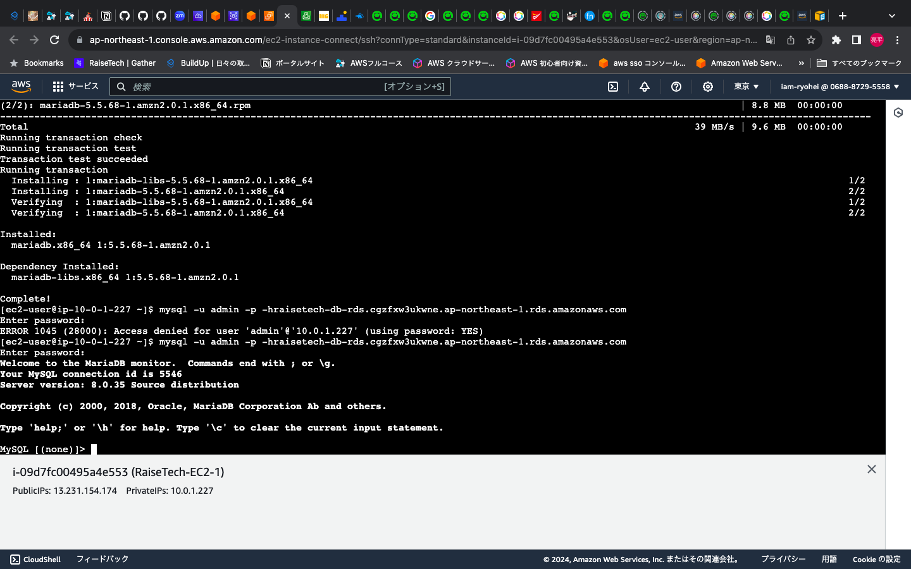