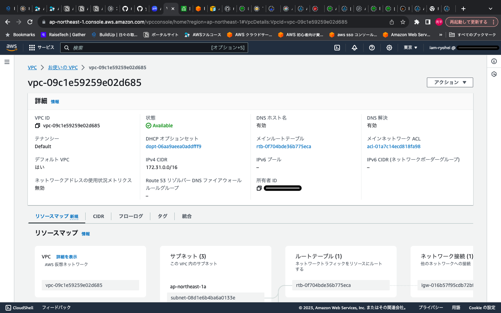
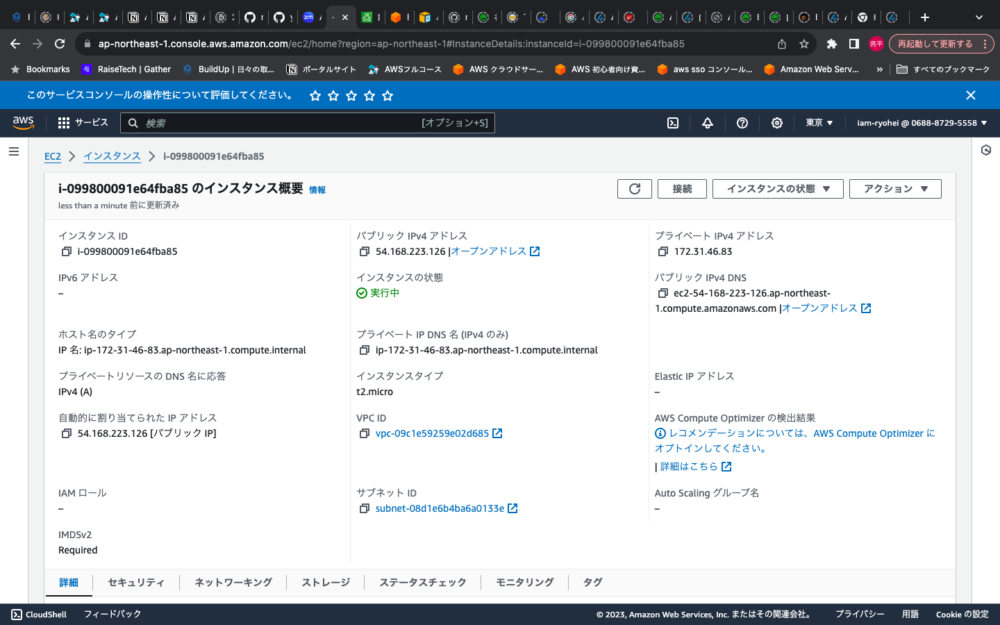
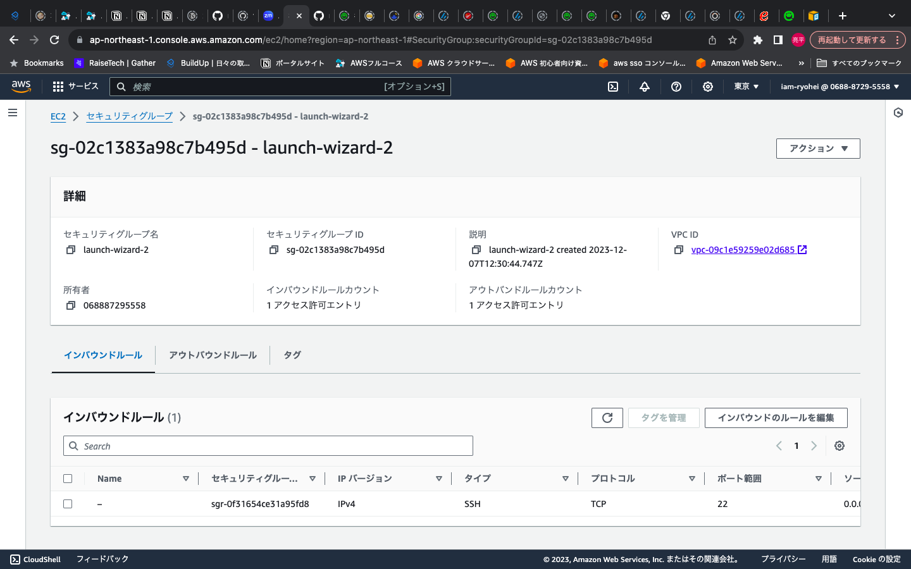
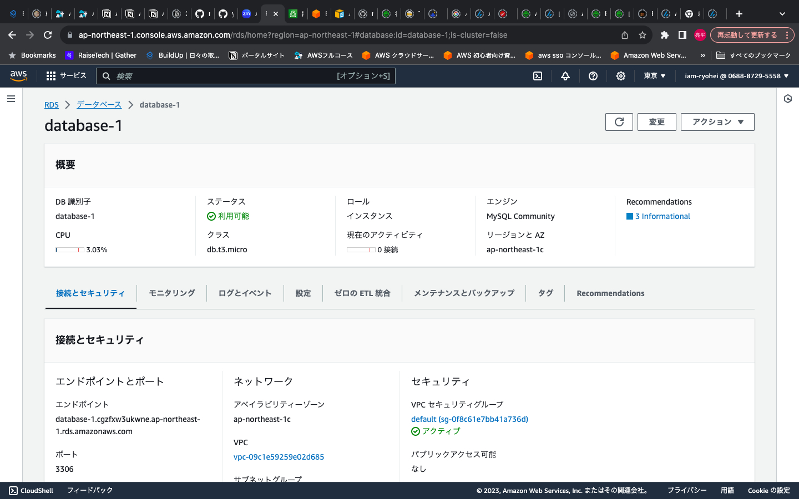
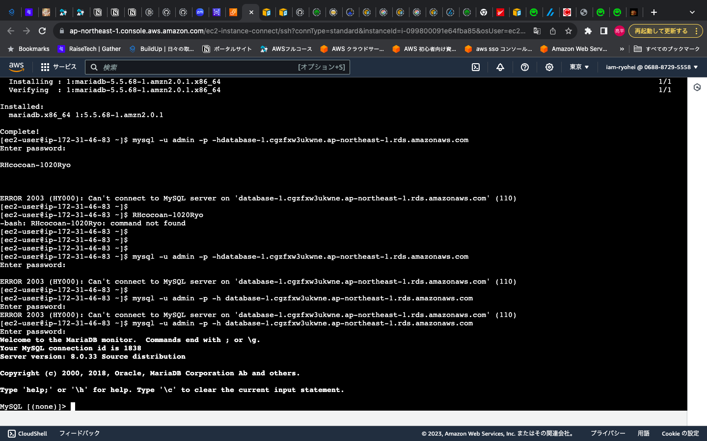

# <第4回課題>

## VPC (Virtual Private Cloud)
  - AWS 内で作成する仮想ネットワークのこと
 

## VPC 構築

 

## EC2 構築

## EC2 セキュリティーグループ

 
 

## RDS 構築

 
 

## EC2からRDSへ接続

 
 
 

     
### * EC2にSSH接続してから、EC2にMySQLをインストール
- $ sudo yum install mysql

### * RDSへの接続
- $ mysql -u admin -p -h データベースのエンドポイント
- パスワード入力が求められるので、設定したパスワードを入力する

